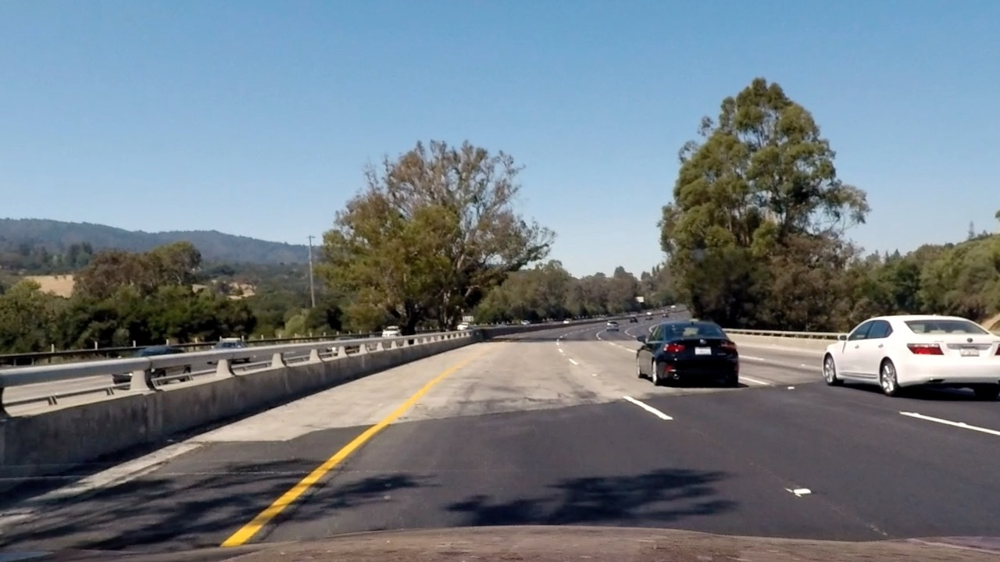
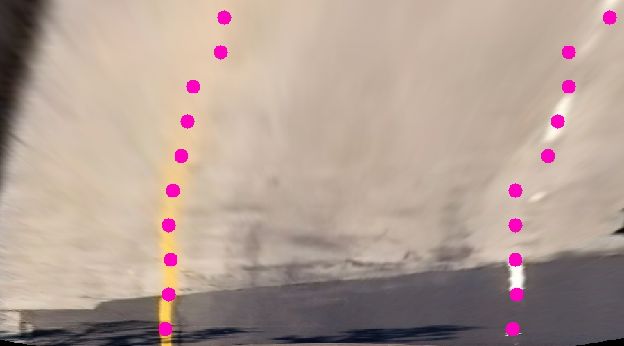
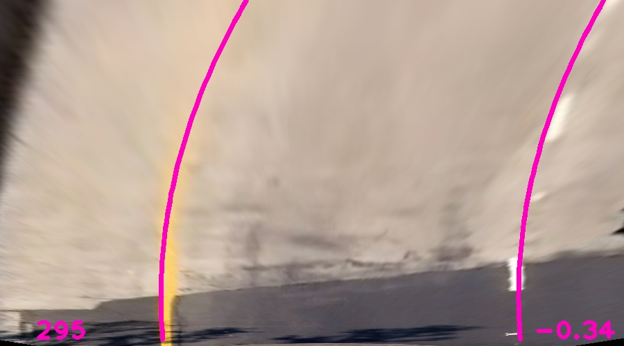
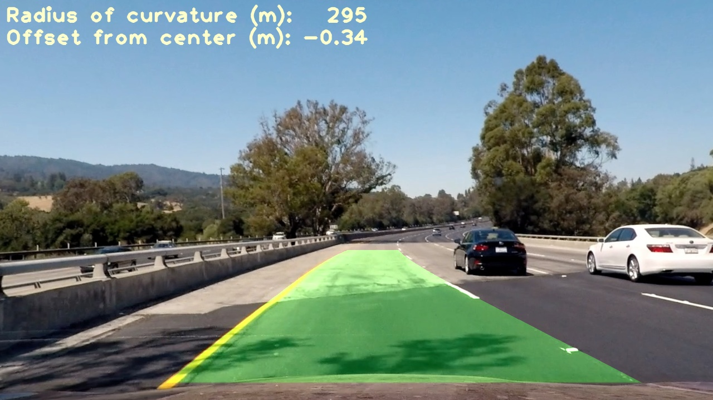

## CarND Project 4: Advanced Lane Lines
In this project I detected lane lines in images taken from a front-facing camera on a car. I corrected for camera
distortion, performed a perspective transform to translate the lane area into a top-down view, used color thresholding
to find areas that were likely lane lines, fit a quadratic polynomial to the estimated lane line centers, and estimated
the curvature of the road using this polynomial.

### Camera Calibration

In order to calibrate the camera, I used several photos of a 10x7 chessboard that were provided to me. For each image,
I used `cv2.findChessboardCorners` from the OpenCV library to find the corners of the chessboard in the image. If all
corners could not be detected, I discarded the image. I then fed these detected corners into the
`cv2.calibrateCamera` function, which returned a camera matrix and a set of distortion coefficients.

Afterwards, I used the camera matrix and distortion coefficients to undistort images from the camera, using the
`cv2.undistort`.

Here is an example of one of the images of the chessboard before and after undistortion:


The code to perform this undistortion is in cells 1-2 of the [notebook](project.ipynb).

### Pipeline (single images)

#### Undistortion

When processing images from the car's camera, the first step was undistorting them as described above:




#### Color thresholding
To find lane lines, I converted the image to the HSV color space and applied thresholds to detect yellow and white
lines.

The thresholds for yellow lines were:

```
15 <= hue <= 30 and 55 < saturation
```
This captures areas that have a hue that is roughly yellow and that are at least somewhat saturated.

The thresholds for white lines were:
```
saturation < 32 and 200 <= value
```

This captures areas that have low overall saturation and are bright.

Here is an example of the areas that are detected as potential lane lines in the above image:


I also experimented with using Sobel operators to detect edges in the input images, but they didn't distinguish
the lane lines as cleanly as color thresholding using HSV, especially in parts of the image that were far away. 

#### Perspective transform
In order to compute the curvature of the road, I first transformed it into a top-down perspective view using
`cv2.perspectiveTransform`. To find reference points for the transform, I started with a sample image that was taken on
a straight section of road and measured the pixel positions of the four corners of the visible lane area, which is a
trapezoid from the camera's vantage point. I mapped these reference points to a square area.
This produced a transformed image like below:


Here is the same perspective transform instead applied to the color-thresholded image above.
The lane lines' shapes are clearly visible:


#### Fitting a polynomial to the lane lines

To model the trajectory of the lane, I fit a quadratic polynomial to the lane lines in the perspective-transformed
version of the image.

I started by calculating, for each column in the color-thresholded perspective image, how many pixels were set in the
lower third of the image. Then I found the columns with the highest number of set pixels on either side of the image's
centerline. These were used as starting points for finding the lane lines.

After that, I performed a horizontal Gaussian blur on the image, which convolves the image data with a Gaussian
in the horizontal direction. Afterwards I divided the blurred image into 10 horizontal slices, and for each slice
starting from the bottom, I calculated the sum of the intensities in each column, similar to the previous paragraph.
I then searched an area 125 pixels to the left and right of the current estimated position for each lane line, and
found the column with the highest overall intensity, and used this column as the estimate for the lane line's position
in that horizontal slice.

This produced point estimates of the lane line's position in each slice, like below:



Then, I calculated the mean distance between the points representing the left and right lane, and used this as an
estimate of the lane's width. After that, I tranposed the right lane points leftwards by the lane width and then fit a
quadratic function to the points (modeling `x` as a function of `y`) using least-squares. This produced a polynomial
that modeled the left lane line, which I then transposed back to the right to get a model for the right lane line.
Here is the result:


#### Calculating curvature and offset from center

To determine the curvature of the road and the offset of the car from center (which can be used to steer the car), I
used the polynomial computed above.

To calculate curvature, I first transformed the `x, y` coordinates in my image into
real-world coordinates, using the horizontal distance between the lane lines and the vertical distance between
subsequent dashed lane markers to estimate the appropriate scaling factors. Then I re-fit a quadratic polynomial and
calculated its radius of curvature using the formula

`R = |(1 + x'^2)^(3/2) / x''|`

which I evaluated using a value of `y` corresponding to the bottom of the image (again remember that we're modeling
`x` as a function of `y`).

To calculate offset from the road's center, I measured the horizontal distance from the image's center to the center
of the two lane lines (again at the bottom of the image), and transformed this value to a real-world distance
using the same scaling factor.

This produced the below result (the radius of curvature is in the lower left and the offset from center is in the lower
right; both are in meters):



It appears that the driver of the car tends to drive about 30 cm left of center on average.

#### Finding the drivable area in the original image

Finally, to visualize the drivable area in the original image, I drew a polygon approximating the area between the two
lane lines in the perspective-transformed image, then reversed the perspective transform and overlayed the result on the
input image. This is the result:



---

### Pipeline (video)

I created a visualization of the drivable area in a video where the car drives along a highway with variations
in the curvature of the road, the color of the road surface, and the lighting of the road surface:

<a href="https://youtu.be/70pzodXlEYo">

</a>
